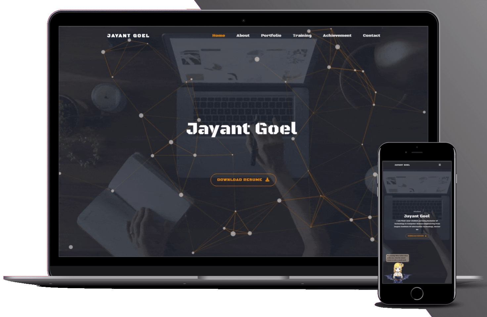

# 👨‍💻 Harinivash Portfolio

A modern, responsive, and interactive personal portfolio website built with **Angular**, showcasing my skills, projects, certifications, achievements, and journey as a **Python Full Stack Developer**.

> This portfolio is inspired by an open-source portfolio structure and has been extensively customized with my own content, projects, branding, and design.

---

## 🌐 Live Demo

**Portfolio:** harinivash-portfolio.vercel.app

---

## 📸 Preview

<p align="center">

</p>

---

# 🚀 About

Hello! I'm **Harinivas**, a passionate **Python Full Stack Developer** who enjoys building modern web applications and solving real-world problems through technology.

I enjoy learning new technologies, improving my problem-solving skills, and creating beautiful user experiences.

My interests include

* Python Development
* Flask
* SQL
* Web Development
* Data Structures & Algorithms
* UI/UX Design
* Artificial Intelligence

---

# ✨ Features

* Responsive Design
* Modern UI/UX
* Smooth Animations
* Dark Theme
* Project Showcase
* Skills Section
* Education Timeline
* Certifications
* Achievements
* Contact Form
* Social Media Links
* SEO Optimized
* Fast Loading
* Mobile Friendly

---

# 🛠 Built With

* Angular
* TypeScript
* HTML5
* CSS3
* Bootstrap
* JavaScript
* Node.js
* Git
* GitHub Pages / Vercel

---

# 💻 Technologies

### Languages

* Python
* SQL
* Java
* C

### Frontend

* HTML5
* CSS3
* Bootstrap
* JavaScript

### Backend

* Flask

### Database

* MySQL

### Tools

* Git
* GitHub
* VS Code
* Figma
* XAMPP

---

# 📂 Projects

## 💰 Personal Finance Tracker

A full-stack finance management system that helps users manage income, expenses, categories, and accounts.

**Tech Stack**

* Python
* Flask
* MySQL
* Bootstrap

---

## 🔐 Password Generator & Strength Checker

A secure password generator with real-time password strength analysis.

**Tech Stack**

* Flask
* Python
* Bootstrap

---

## 🎮 Rock Paper Pencil Scissors Game

A fun Flask-based web game where users compete against the computer.

**Tech Stack**

* Flask
* Python
* HTML
* CSS

---

## 🤟 Sign Language Learning Platform

An educational web application designed to help users learn sign language alphabets and numbers.

**Tech Stack**

* Flask
* Bootstrap
* Python

---

# 🎓 Education

**Bachelor of Engineering**

Computer Science and Design

Kongu Engineering College

Tamil Nadu, India

---

# 🏆 Certifications

* Oracle Cloud Infrastructure 2025 Certified Generative AI Professional
* Oracle APEX Cloud Developer
* Java Development

---

# 🏅 Achievements

* Solved Data Structures & Algorithms problems
* LeetCode 50 Days Badge
* Developed multiple Full Stack Projects
* Open Source Learning

---

# 📬 Connect With Me

### GitHub

https://github.com/HARINIVASH-S

### LinkedIn

https://linkedin.com/in/harinivash-s-976a25303

### LeetCode

https://leetcode.com/u/jbt4AyoybI/

---

# 📁 Folder Structure

```text
Portfolio
│
├── src
│   ├── app
│   ├── assets
│   ├── environments
│   └── screenshots
│
├── package.json
├── angular.json
├── README.md
└── Dockerfile
```

---

# ⚙ Installation

Clone the repository

```bash
git clone https://github.com/HARINIVASH-S/portfolio.git
```

Move into the project

```bash
cd portfolio
```

Install dependencies

```bash
npm install
```

Run the application

```bash
ng serve
```

Open

```
http://localhost:4200
```

---

# 🚀 Deployment

Build the production version

```bash
ng build
```

Deploy the generated files to

* GitHub Pages
* Vercel
* Netlify
* Firebase Hosting

---

# 📈 SEO

The portfolio includes

* Open Graph Tags
* Twitter Cards
* Structured Data (JSON-LD)
* Sitemap
* Robots.txt
* Meta Description
* Responsive Images

---

# 🎨 Customization

You can easily customize

* Personal Information
* Skills
* Projects
* Education
* Experience
* Certifications
* Theme Colors
* Social Links
* Resume
* Profile Picture

---

# 🤝 Contributing

If you find any bugs or have suggestions for improvements, feel free to open an issue or submit a pull request.

---

# ⭐ Support

If you like this portfolio, consider giving the repository a **⭐ Star**.

---

# 📄 License

This project is licensed under the **MIT License**.

---

# 👨‍💻 Developer

**Harinivas**

Python Full Stack Developer

GitHub

https://github.com/HARINIVASH-S

LinkedIn

https://linkedin.com/in/harinivash-s-976a25303

LeetCode

https://leetcode.com/u/jbt4AyoybI/

---

## 🙏 Acknowledgements

This portfolio was inspired by the open-source developer community. The original project served as a learning reference and has been extensively customized with my own branding, content, projects, and enhancements.
